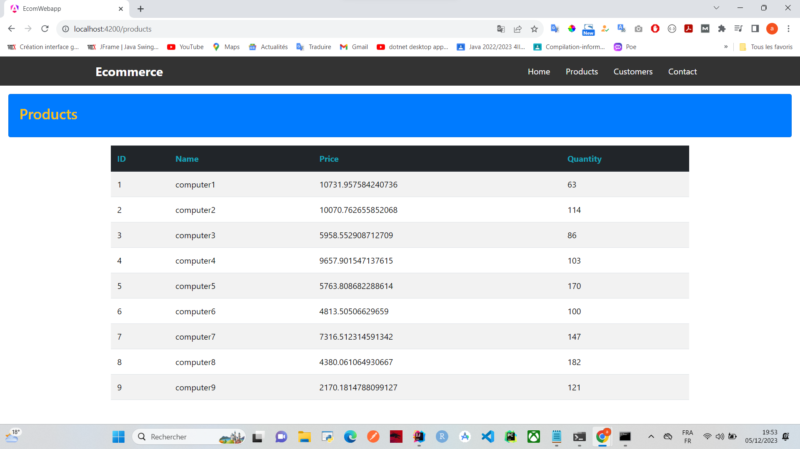
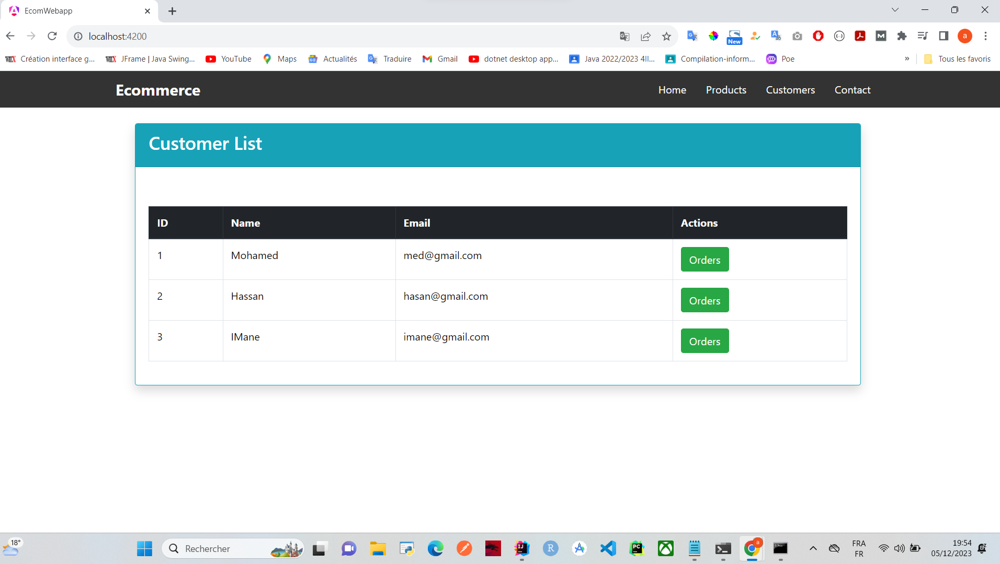
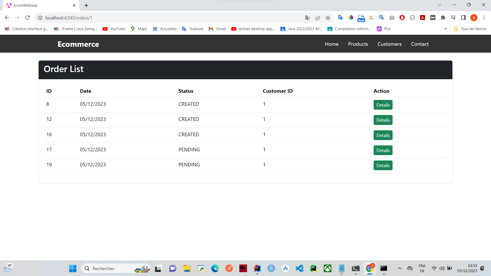
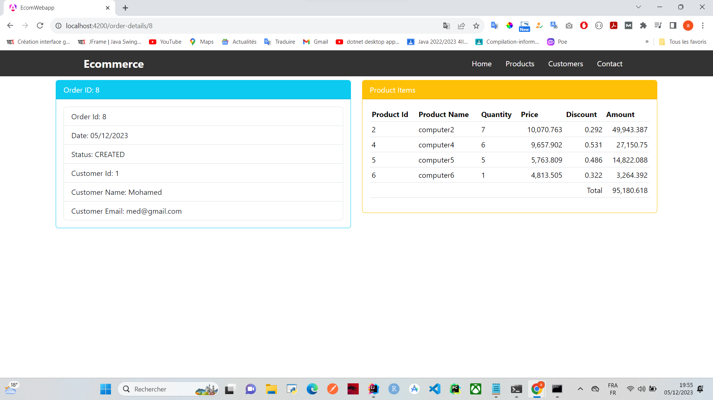
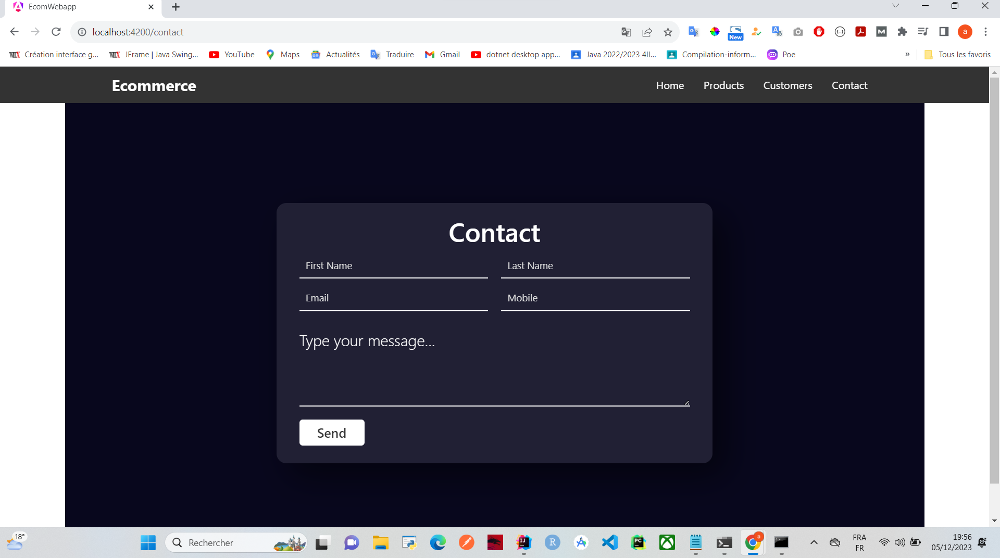
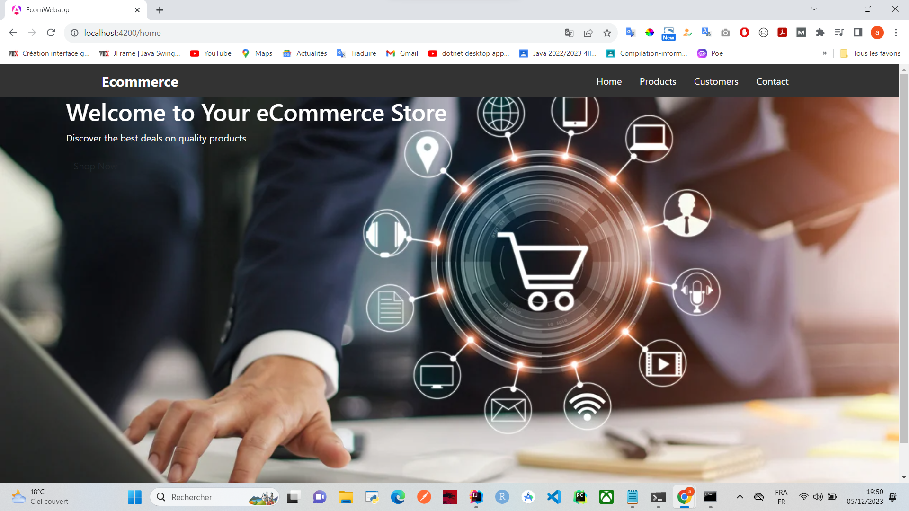

# Spring-App
Application using microservices architecture

# Setup du projet 
    installation des Microservice 
# Lien vers
    spring.io
# Structure du proje
    consul-discovery: Service de découverte Consul.
    spring-cloud-config: Configuration centralisée avec Spring Cloud Config.
    spring-cloud-gateway: Passerelle API avec Spring Cloud Gateway.
    customer-service: Microservice de gestion des clients.
    inventory-service: Microservice de gestion des stocks.
    order-service: Microservice de gestion des commandes.
    consul-config: Configuration Consul pour le service de facturation.
    vault: Configuration Vault pour le service de facturation.
    frontend-angular: Frontend Web développé avec Angular.

# config-service qui va contenir nos configuration
    Utilisation des dependances suivante
    config server
    Actuator
    Consul Discovery(pour enregistrement des utilisateur)
# customer-service microservice pour les client
    Utilisation des dependances suivante
    Spring web
    Spring data jpa(base de données)
    H2 database
    Lombok(les annotations)
    RestRepositories
    config client
    Actuator
    Consul Discovery(pour enregistrement des utilisateur)
# inventory-service microservice pour les client
    Utilisation des dependances suivante
    Spring web
    Spring data jpa(base de données)
    H2 database
    Lombok(les annotations)
    RestRepositories
    config client
    Actuator
    Consul Discovery(pour enregistrement des utilisateur)
# order-service microservice pour les client
    Utilisation des dependances suivante
    Spring web
    Spring data jpa(base de données)
    H2 database
    Lombok(les annotations)
    RestRepositories
    config client
    Actuator
    Consul Discovery(pour enregistrement des utilisateur)
# Création d'un projet vide nommée("Act4_MASKI")

# Configuration de Consul descovery

<h3>Commande pour lancer Consul</h3>
<strong>> consul agent -server -bootstrap-expect=1 -data-dir=consul-data -ui -bind=192.168.43.32</strong>
<h3>Commande pour lancer Vault</h3>
<strong>> vault server -dev</strong>

# affichage des produit
</img>

# affichages des clients
</img>

# affichages des commandes des clients
</img>

# affichages des details pour chaque commande

</img>

# page contact

</img>
# page home
</img>
 
